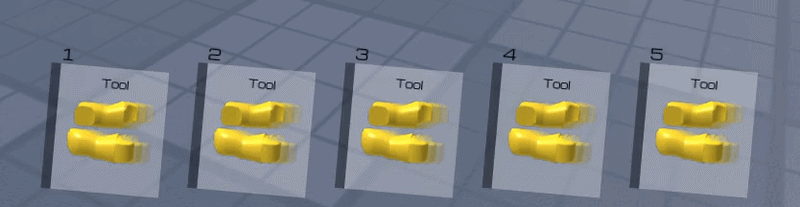

### HOTBAR SYSTEM by angrykidq 

#### DESCRIPTION
-   A flexible and lightweight hotbar system for Roblox.
-   Features a built-in error logging system for easy debugging.

#### SETUP
1. Ungroup Models into required Folder.
2. Duplicate the Template tool.
3. Place your Model inside the duplicate.
4. Insert the required Scripts and Models into it.
5. Adjust the configuration Values to fit your needs.

- Maximum slot count: 5

#### LICENSE
- This system is licensed under the angrykidq Source Available License.
- ✔ You MAY use this in your game, including paid/commercial games.
- ✘ You MAY NOT sell this system directly or in modified form on any marketplace or asset store.
